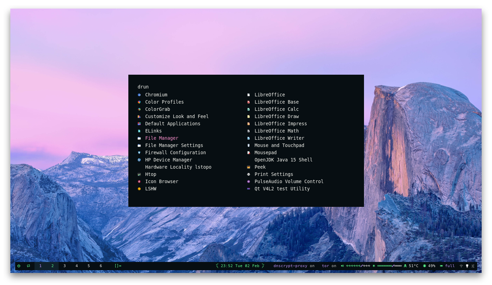

### dotfile dengan chezmoi
```txt
os > arch linux
wm > dwm
bar > polybar
terminal > rxvt-unicode
compositor > picom
launcher > rofi
```
#### Table of contents
- [Screenshot](#screenshot)
- [Patches](#patches)
- [Install](#Instal)
- [Setup](#Setup)
- [Login](#Login)
- [Keybinds sxhkd](#sxhkd)
- [Keybinds dwm](#dwm) 

##### screenshot





##### patches
1. alwaysontop-6.2.diff
2. dwm-activetagindicatorbar-6.2.diff
3. dwm-alwayscenter-20200625-f04cac6.diff
4. dwm-anybar-polybar-tray-fix-20200905-bb2e722.diff
5. dwm-barpadding-20200720-bb2e722.diff
6. [dwm-center.diff](https://www.reddit.com/r/suckless/comments/cphe3h/dwm_center_floating_window_with_multiple_monitors/ewqnx65?utm_source=share&utm_medium=web2x&context=3)
7. dwm-focusonnetactive-6.2.diff
8. dwm-ipc-20201106-f04cac6.diff
9. dwm-movestack-6.1.diff
10. dwm-noborder-6.2.diff
11. dwm-pertag-20200914-61bb8b2.diff
12. dwm-restartsig-20180523-6.2.diff
13. dwm-scratchpad-20200727-bb2e7222baeec7776930354d0e9f210cc2aaad5f.diff
14. dwm-sticky-6.1.diff
15. dwm-swallow-20201211-61bb8b2.diff
16. dwm-tapresize-20200819-f04cac6.diff
17. dwm-togglefullscreen-6.2.diff
18. dwm-vanitygaps-6.2.diff
19. [shiftview](https://lists.suckless.org/dev/1104/7590.html)

##### Instal
###### install depans gunakan [yay](https://github.com/Jguer/yay#installation)
	curl -o installdepends.txt https://raw.githubusercontent.com/farell1011/dots/main/installdepends.txt
	yay -S --needed --noconfirm $(grep -E "^[a-z]" ./installdepends.txt)

###### apply config to ~/
	chezmoi init --apply --verbose https://github.com/farell1011/dots.git
		
###### install dwm
	cd dwm
	sudo make clean install
	sudo make clean
	cd ~/

###### install st terminal (opsional)
	cd st
	sudo make clean install
	sudo make clean
	cd ~/

###### patch urxvt fix segmentation fault error
	cd rxvt-unicode
	makepkg -g >> PKGBUILD
	makepkg --nobuild
	makepkg -i --noextract

##### Setup
###### group wheel sudo tanpa password edit /etc/pam.d/sudo tambahkan pada baris pertama
	auth           sufficient      pam_wheel.so trust use_uid

###### edit /etc/resolv.conf (untuk dnscrypt)
	nameserver 127.0.0.1

###### write-protect (agar tdk bisa dirubah oleh network manager)
	sudo chattr +i /etc/resolv.conf

###### enable service
	sudo systemctl enable dnscrypt-proxy.service
	sudo systemctl start dnscrypt-proxy.service
	sudo systemctl enable NetworkManager.service
	systemctl --user enable --now geoclue-agent.service

###### opsional (bisa) dihapus
	rm -rf {scot,README.md,installdepends.txt}

	* folder ~/dwm adalah source dari dwm,
	* folder ~/St adalah source dari st,
	* kita bisa menambah patch/merubah keybinding dan compile ulang

###### tambahkan pada /etc/geoclue/geoclue.conf
	[redshift]
	allowed=true
	system=false
	users=

###### tmux tpm plugin
	git clone https://github.com/tmux-plugins/tpm ~/.tmux/plugins/tpm
	tmux
	Press `prefix` + <kbd>I</kbd> (capital i, as in **I**nstall) to fetch the plugin.

##### sxhkd
<kbd>super</kbd>  = <kbd>Windows Key</kbd> 
| Keybind | Action |
| --- | --- |
| <kbd>super + Return</kbd> | urxvt terminal |
| <kbd>super + z</kbd> | terminal scratchpad (untuk menampilkan super + n, untuk menyembunyikan super + m) |
| <kbd>super + p</kbd> | rofi drun (aplikasi launcher) |
| <kbd>super + w</kbd> | rofi window (switch tag list) |
| <kbd>super + slash</kbd> | thunar file manager |
| <kbd>ctrl + shift + l</kbd> | screen lock |
| <kbd>super + i</kbd> | browser chromium |
| <kbd>super + shift + i</kbd> | browser chromium dengan tor proxy |
| <kbd>super + ctrl + i</kbd> | browser chromium dengan burp proxy |
| <kbd>super + a</kbd> | mousepad |
| <kbd>super + shift + a</kbd> | gedit |
| <kbd>super + shift + b</kbd> | burpsuite |
| <kbd>super + shift + t</kbd> | tor browser |
| <kbd>alt + Print</kbd> | screencast (peek) |
| <kbd>Print</kbd> | rofi screenshots menu |
| <kbd>super + Print</kbd> | screenshots root window |
| <kbd>super + shift + Print</kbd> | screenshots select window |
| <kbd>super + ctrl + Print</kbd> | screenshots delay 5 seconds |
| <kbd>XF86AudioMute</kbd> | volume mute |
| <kbd>XF86AudioRaiseVolume</kbd> | volume raise |
| <kbd>XF86AudioLowerVolume</kbd> | volume lower |
| <kbd>super + XF86AudioRaiseVolume</kbd> | volume raise (ncmpcpp) |
| <kbd>super + XF86AudioLowerVolume</kbd> | volume lower (ncmpcpp) |
| <kbd>alt + ctrl + Left</kbd> | mpc prev |
| <kbd>alt + ctrl + Right</kbd> | mpc next |
| <kbd>alt + ctrl + Down</kbd> | mpc stop |
| <kbd>alt + ctrl + Up</kbd> | mpc play |
| <kbd>ctrl + shift + m</kbd> | show ncmpcpp playlist |
| <kbd>alt + shift + m</kbd> | show ncmpcpp visualizer |
| <kbd>super + shift + q</kbd> | rofi poweroff/logout/reboot menu |
| <kbd>XF86MonBrightnessUp</kbd> | brightness up |
| <kbd>XF86MonBrightnessDown</kbd> | brightness down |

##### dwm
<kbd>super</kbd>  = <kbd>Windows Key</kbd> 
| Keybind | Action |
| --- | --- |
| <kbd>super + ctrl + r</kbd> | reload polybar |
| <kbd>super + shift + r</kbd> | reload dwm |
| <kbd>super + b</kbd> | togglebar (sesudah toggle bar reload polybar super + ctrl + r) |
| <kbd>super + j</kbd> | focusstack + |
| <kbd>super + k</kbd> | focusstack - |
| <kbd>super + shift + Up</kbd> | incnmaster + |
| <kbd>super + shift + down</kbd> | incnmaster - |
| <kbd>super + shift + left</kbd> | setmfact - |
| <kbd>super + shift + right</kbd> | setmfact + |
| <kbd>super + shift + retun</kbd> | zoom |
| <kbd>super + tab</kbd> | view |
| <kbd>super + q</kbd> | killclient |
| <kbd>super + x</kbd> | setlayout tile []= |
| <kbd>super + ctrl + x</kbd> | setlayoutmonocle [M] |
| <kbd>super + shift + x</kbd> | setlayout spiral [@] |
| <kbd>alt + x</kbd> | setlayout grid ::: |
| <kbd>alt + shift + x</kbd> | gaplessgrid grid ### |
| <kbd>super + space</kbd> | toggle spiral/tile |
| <kbd>super + shift + space</kbd> | togglefloating |
| <kbd>super + 0</kbd> | view ~ |
| <kbd>super + shift + 0</kbd> | tag ~ |
| <kbd>super + ,</kbd> | focusmon - |
| <kbd>super + .</kbd> | focusmon + |
| <kbd>super + shift + ,</kbd> | tagmon - |
| <kbd>super + shift + .</kbd> | tagmon + |
| <kbd>super + 1-7</kbd> | pergi ke tag 1-7 |
| <kbd>super + shift + 1-7</kbd> | move client ke tag 1-7 |
| <kbd>ctrl + shift + left</kbd> | movestack + |
| <kbd>ctrl + shift + right</kbd> | movestack - |
| <kbd>super + right</kbd> | shiftview + (next tag) |
| <kbd>super + left</kbd> | shiftview - (prev tag) |
| <kbd>super + m</kbd> | scratchpad hide |
| <kbd>super + n</kbd> | scratchpad show |
| <kbd>super + s</kbd> | toggle sticky |
| <kbd>super + c</kbd> | center floating |
| <kbd>super + f</kbd> | toggle fullscreen |
| <kbd>super + t</kbd> | toggle alwaysontop |
| <kbd>super + `</kbd> | load xrdb |
| <kbd>hold super + 2 tap touchpads</kbd> | resize floating |
| <kbd>hold super + 1 tap touchpads</kbd> | move floating |
| <kbd>super + ctrl + up</kbd> | gaps all + |
| <kbd>super + ctrl + down</kbd> | gaps all - |
| <kbd>super + ctrl + right</kbd> | gaps inner all + |
| <kbd>super + ctrl + left</kbd> | gaps inner all - |
| <kbd>super + ctrl + shift + up</kbd> | gaps outner all + |
| <kbd>super + ctrl + shift + down</kbd> | gaps outner all - |
| <kbd>alt + shift + up</kbd> | gaps inner top bottom + |
| <kbd>alt + shift + down</kbd> | gaps inner top bottom - |
| <kbd>alt + shift + right</kbd> | gaps inner left right + |
| <kbd>alt + shift + left</kbd> | gaps inner left right - |
| <kbd>super + alt + up</kbd> | gaps outner top bottom + |
| <kbd>super + alt + down</kbd> | gaps outner top bottom - |
| <kbd>super + alt + right</kbd> | gaps outner left right + |
| <kbd>super + alt + left</kbd> | gaps outner left right - |
| <kbd>super + ctrl + shift + 0</kbd> | disable gaps |
| <kbd>super + ctrl + shift + =</kbd> | default gaps |

##### config awesome & i3 include
```txt
os > arch linux
wm > awesome, i3-gaps
bar > polybar
terminal > rxvt-unicode
compositor > picom
launcher > rofi
```
##### screenshot ***awesome+polybar***
 

##### screenshot ***i3+polybar***

